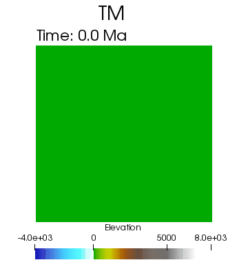
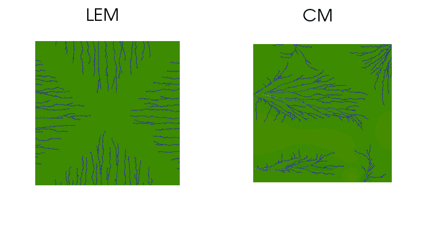

UWG - Rivers & Mountains
=====

This tutorial provides a numerical modeling case of drainage evolution influenced by tectonics coupled with surface processes. It's a 3-D fully coupled model built by UWGeodyanmics module [(Beucher et al., 2018)](https://www.theoj.org/joss-papers/joss.01136/10.21105.joss.01136.pdf).

| | |
| :---: | :---: |
| | |

### **Model settings**

The model in "3DCM_Indentor.ipynb" is mostly based on the mechanical tectonic model from [Houseman, G. & England, P. (1986)](https://agupubs.onlinelibrary.wiley.com/doi/abs/10.1029/JB091iB03p03664). This model has similar geometry and boundary conditions with their Model, and beening coupled with surface processes in three dimensions.

### **Numerical implementation**

The UWGeodynamics module [(Beucher et al., 2018)](https://www.theoj.org/joss-papers/joss.01136/10.21105.joss.01136.pdf) is used here to develop numerical models. This module is based on Underworld 2 (Moresi et al., 2007) and combines it with Badlands (Salles et al., 2018). The model derived by UWGeodynamics is a two-way coupled thermo-mechanical model with surface processes, where the velocity field retrieved from the thermo-mechanical model is used to advect the surface in the surface processes model. The surface subjected to erosion and deposition. The distribution of materials in the model is then updated. You can find it on [Github](https://github.com/underworldcode/UWGeodynamics).

Docker is highly recommended to run the module. The recommended image version is: underworldcode/uwgeodynamics: 2.8.4 (or above).

### **Visualisation**

For an in-depth visualisation of the model output, it is recommended to use a visualisation package such as [Paraview](http://www.paraview.org).

**Underworld** outputs are created in the directory you've specified in this script. The folder contains xdmf series files: **XDMF.fields.xdmf** which will display the time series of all fields (e.g. temperature, velocity, rheology et al.).

**Badlands** outputs are created in the directory you've specified in your **XmL** input file. The folder contains xdmf series files:
+ **tin.series.xdmf** which will display the time series of surface evolution.
+ **flow.series.xdmf** which will display the time series of drainage network evolution.